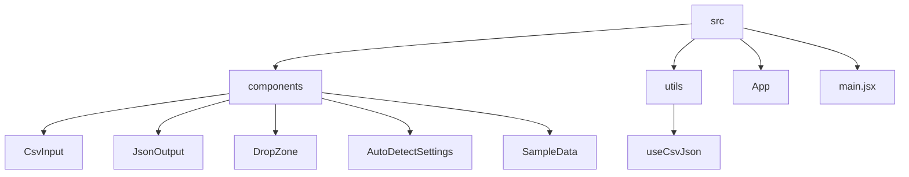

# CSV2JSON Converter

## 🗂️ Description

The CSV2JSON Converter is a web application designed to convert CSV (Comma Separated Values) files to JSON (JavaScript Object Notation) format. This tool is useful for developers, data analysts, and anyone who needs to work with data in both CSV and JSON formats. The application provides a simple and intuitive interface for uploading CSV files, selecting delimiter options, and downloading the converted JSON data.

The CSV2JSON Converter is built using modern web technologies, including React, Vite, and Tailwind CSS, ensuring a fast, responsive, and user-friendly experience.

## ✨ Key Features

### Core Features

* **CSV to JSON Conversion**: Convert CSV files to JSON format with ease
* **Delimiter Selection**: Choose from various delimiter options, including auto-detection
* **File Upload**: Upload CSV files directly or paste CSV data into the application
* **JSON Output**: Display and download converted JSON data

### User Interface

* **Sample Data**: View sample CSV data to get started
* **Drop Zone**: Easily upload CSV files or click to browse
* **Auto-Detect Settings**: Select delimiter and auto-detect settings for accurate conversion

## 🗂️ Folder Structure

## 🛠️ Tech Stack

## ⚙️ Setup Instructions

To run the CSV2JSON Converter locally:

* Clone the repository: `git clone https://github.com/ebhay/CSV2JSON.git`
* Install dependencies: `npm install`
* Start the application: `npm run dev`
* Open your web browser and navigate to `http://localhost:5173`

## 📁 Configuration Files

The application uses the following configuration files:

* `vite.config.js`: Vite build tool configuration
* `eslint.config.js`: ESLint configuration for JavaScript linting
* `.gitignore`: Git ignore file for ignoring specific files and directories

## 🤝 GitHub Actions

The repository uses GitHub Actions for automated workflows. The workflow files are located in the `.github/workflows` directory.

## 📝 Code Structure

The application code is organized into the following directories:

* `src`: Source code directory
	+ `components`: React component directory
	+ `utils`: Utility function directory
	+ `App.jsx`: Main application component
	+ `main.jsx`: Main entry point of the application

  

<h3>Abhay Gupta</h3>

Passionate developer & lifelong learner, seeking to break boundaries through code.

 

  <a href="https://gitfull.vercel.app">Made by GitFull</a>

    
