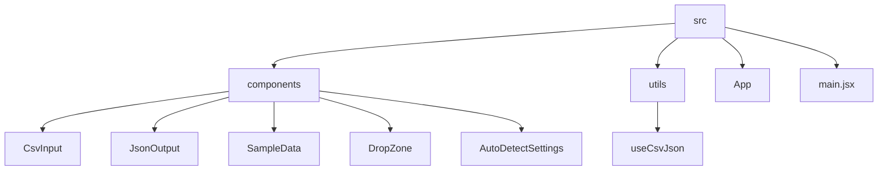

# CSV2JSON Converter

## 🗂️ Description

The CSV2JSON Converter is a web application designed to convert CSV (Comma Separated Values) data to JSON (JavaScript Object Notation) format. This tool is particularly useful for developers and data analysts who need to work with data in JSON format but have it available in CSV. The application provides a user-friendly interface for uploading CSV files, pasting CSV data, or using sample data to generate equivalent JSON.

## ✨ Key Features

### Core Functionality
- **CSV to JSON Conversion**: The application takes CSV data as input and converts it into JSON format.
- **File Upload**: Users can upload CSV files directly to the application for conversion.
- **CSV Input**: A textarea is provided for users to paste their CSV data manually.
- **Sample Data**: A sample CSV data option is available for users to test the conversion feature.

### User Interface
- **Json Output**: The converted JSON data is displayed in a readable format.
- **Copy and Download**: Users can copy the JSON data to their clipboard or download it as a JSON file.

### Settings
- **Auto-Detect Settings**: The application allows users to auto-detect delimiters and select from a list of common delimiters.

## 🗂️ Folder Structure



## 🛠️ Tech Stack


## ⚙️ Setup Instructions

To run the CSV2JSON Converter locally, follow these steps:

1. **Clone the Repository**:
   ```bash
git clone https://github.com/ebhay/CSV2JSON.git
```
2. **Navigate to the Project Directory**:
   ```bash
cd CSV2JSON
```
3. **Install Dependencies**:
   ```bash
npm install
```
4. **Start the Development Server**:
   ```bash
npm run dev
```
5. **Open the Application**:
   Navigate to `http://localhost:5173` in your web browser to use the application.

## 🤖 GitHub Actions

The repository utilizes GitHub Actions for continuous integration and deployment. Workflows are set up to:
- **Lint and Format Code**: Run ESLint and format code on push events.
- **Build and Deploy**: Automatically build and deploy the application to a hosting platform on successful pull requests to the main branch.

No specific workflow files are included in the basic template, but you can find them in the `.github/workflows` directory of the repository.


<br><br>
<div align="center">

<h3>Abhay Gupta</h3>
<p>Passionate developer and lifelong learner, breaking and rebuilding code to craft seamless interactions.</p>
</div>
<br>
<p align="right">
  <a href="https://gitfull.vercel.app">Made by GitFull</a>
</p>
    