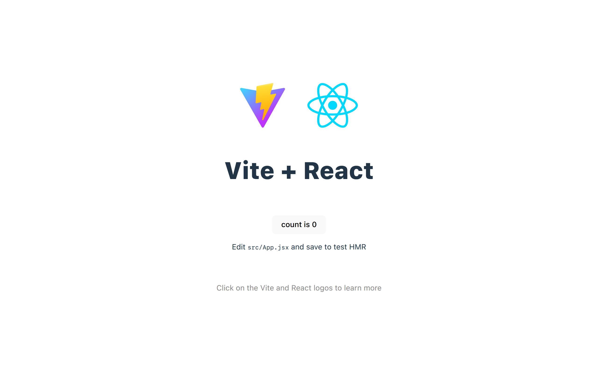
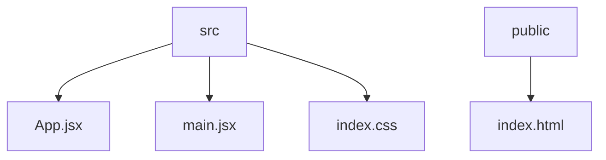

# CSV2JSON Converter

## 🗂️ Description

The CSV2JSON repository is a tool designed to convert CSV files to JSON format. This project is for developers and data analysts who need to work with data in JSON format but have it available in CSV. The tool aims to simplify the data conversion process, making it easier to integrate CSV data into applications that require JSON.

The converter is built using modern web technologies, ensuring a fast, efficient, and scalable conversion process. It provides a straightforward way to upload CSV files and download the equivalent JSON data.

## ✨ Key Features

### Core Features
- **CSV to JSON Conversion**: The primary feature of the tool is to convert CSV files into JSON format.
- **File Upload**: Users can upload CSV files directly to the tool.
- **JSON Output**: The tool generates JSON output that can be easily downloaded or used directly in applications.

### Technical Features
- **React Frontend**: The user interface is built with React, providing an interactive and responsive experience.
- **Vite Build Tool**: Vite is used for building and serving the application, ensuring fast development and production builds.
- **ESLint for Linting**: The project uses ESLint for code linting, maintaining code quality and consistency.

## 🗂️ Folder Structure



## 🛠️ Tech Stack


## ⚙️ Setup Instructions

To run the project locally, follow these steps:

1. **Clone the Repository**:
   ```bash
   git clone https://github.com/ebhay/CSV2JSON.git
   ```
2. **Navigate to the Project Directory**:
   ```bash
   cd CSV2JSON
   ```
3. **Install Dependencies**:
   ```bash
   npm install
   ```
4. **Start the Development Server**:
   ```bash
   npm run dev
   ```
5. **Open the Application**:
   Open your web browser and navigate to `http://localhost:5173` to use the application.

## 🤔 Known Issues and Future Development

The current version of the CSV2JSON converter provides basic functionality. Future developments may include:
- Support for larger CSV files
- More advanced data transformation options
- Integration with data storage solutions

## 📁 File Structure Explanation

- `vite.config.js`: Configuration file for Vite, defining the build process.
- `.gitignore`: Specifies files and directories ignored by Git.
- `src/main.jsx`: Main entry point for the React application.
- `index.html`: HTML entry point for the project.
- `package.json`: Project metadata and dependencies.
- `eslint.config.js`: ESLint configuration for code linting.
- `src/App.jsx`: Defines the App component, a part of the React application.


<br><br>
<div align="center">

<h3>Abhay Gupta</h3>
<p>Passionate developer & lifelong learner, seeking to break boundaries through code.</p>
</div>
<br>
<p align="right">
  <a href="https://gitfull.vercel.app">Made by GitFull</a>
</p>
    