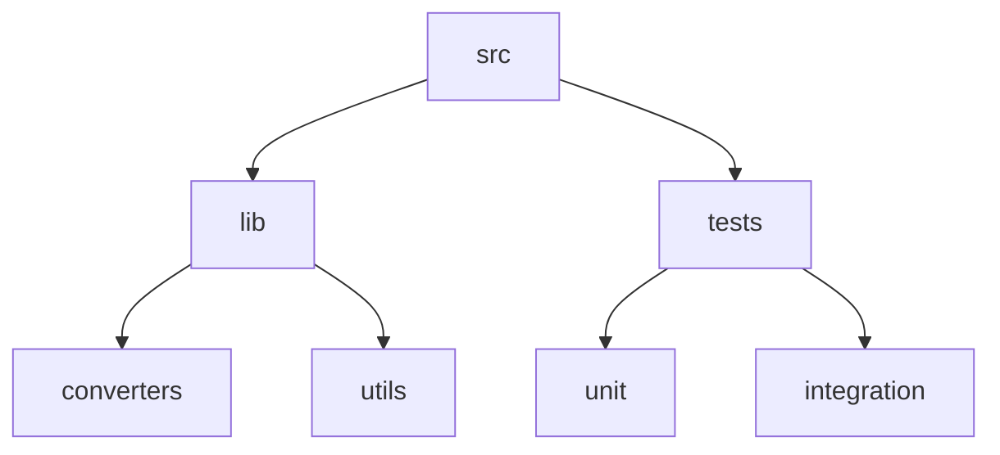
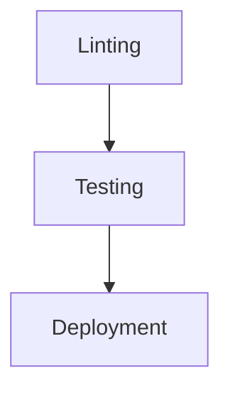

# CSV2JSON Converter
## 🗂️ Description

The CSV2JSON repository provides a tool for converting CSV files to JSON format. This project is designed for developers and data analysts who need to work with data in JSON format but have it available in CSV. The tool aims to simplify the data conversion process, making it easier to integrate CSV data into applications that require JSON.

The converter is built with a focus on simplicity, performance, and ease of use. It supports various features that enable efficient conversion, including handling large files, customizable conversion options, and robust error handling.

## ✨ Key Features

### Core Features
- **CSV to JSON Conversion**: Efficiently converts CSV files to JSON format.
- **Large File Support**: Handles large CSV files with ease, making it suitable for big data applications.
- **Customizable Options**: Offers options for customizing the conversion process, such as specifying JSON output format and handling CSV headers.

### Technical Features
- **Modular Design**: Built with a modular architecture for easy maintenance and extension.
- **Error Handling**: Robust error handling to manage conversion errors and provide meaningful feedback.

## 🗂️ Folder Structure



## 🛠️ Tech Stack


## ⚙️ Setup Instructions

To run the CSV2JSON converter locally, follow these steps:

- **Step 1: Clone the Repository**
  ```bash
  git clone https://github.com/ebhay/CSV2JSON.git
  ```
- **Step 2: Install Dependencies**
  ```bash
  cd CSV2JSON
  npm install
  ```
- **Step 3: Run the Converter**
  ```bash
  npm start
  ```
- **Step 4: Use the Converter**
  Use the converter by providing a CSV file as input and specifying the desired JSON output.

## 🤖 GitHub Actions

This repository utilizes GitHub Actions for continuous integration and deployment. The workflow is defined in `.github/workflows/main.yml` and includes steps for:

- **Linting**: Runs ESLint to ensure code quality and consistency.
- **Testing**: Executes unit and integration tests to validate the converter's functionality.
- **Deployment**: Deploys the converter to a hosting platform for public access.



## 📁 Files and Directories

- `.vscode/extensions.json`: Recommendations for Visual Studio Code extensions.
- `src/main.js`: Main entry point of the application.
- `vite.config.js`: Configuration file for Vite.
- `.gitignore`: Specifies files and directories ignored by Git.
- `index.html`: Main HTML file of the application.
- `package.json`: Project metadata and scripts.
- `src/App.vue`: Root component of the application.
- `src/components/HelloWorld.vue`: Reusable Vue.js component.


<br><br>
<div align="center">

<h3>Abhay Gupta</h3>
<p>Passionate developer & lifelong learner, breaking and rebuilding to craft better experiences.</p>
</div>
<br>
<p align="right">
  <a href="https://gitfull.vercel.app">Made by GitFull</a>
</p>
    